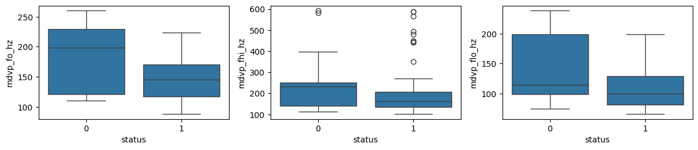
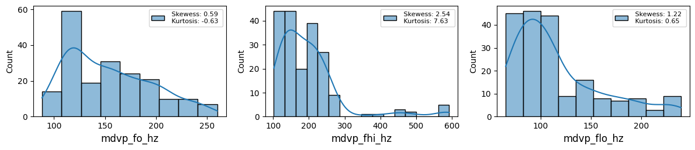
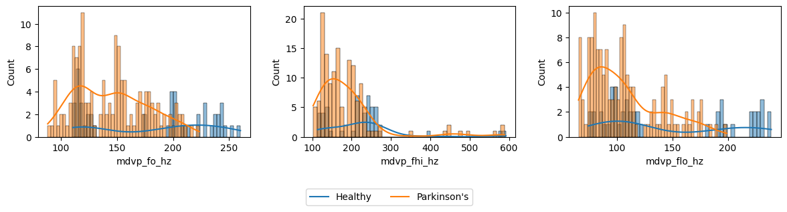
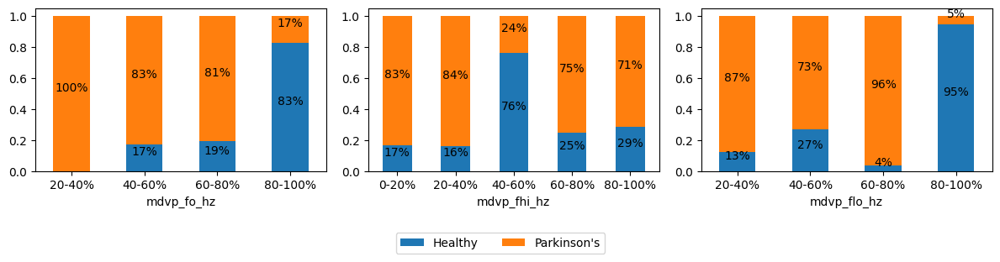
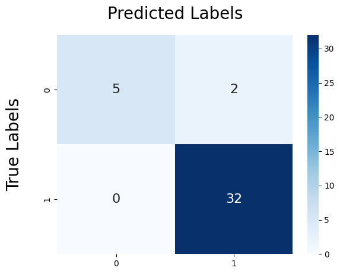
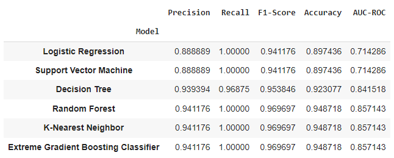
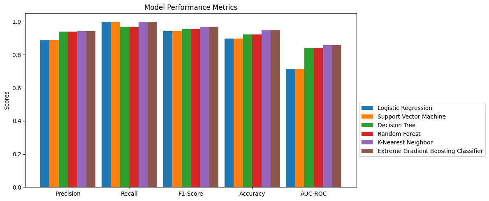

# *Prediction of Parkinson's Disease*

## Purpose of the Analysis

This was a joint work with [Rafael Correa
Morales](https://github.com/usuariodf) with the objective of predicting the
probability that a person will develop Parkinson's disease (PD).

The main objective of this project is to develop a categorization system to
discriminate between healthy people and those suffering from Parkinson's
disease using a biomedical data set of voice measurements. This system will be
implemented using several **machine learning models**, with the purpose of
accurately identifying and classifying individuals according to their health
status based on vocal characteristics.

## Objective of the project 
Our main objective was to improve our
communication, interpretation and machine learning skills, creating a
collaborative project as part of our self-study in the field of data science.
This project not only allowed us to apply our theoretical knowledge in a
practical case, but also to develop our abilities to work as a team and solve
complex problems effectively.

## Approach and Methodology

To achieve our objectives, we followed a structured approach that included
several key stages:

**Data Exploration and Preparation:** Exploratory data analysis (**EDA**) to
understand the distribution and characteristics of vocal measurements. Data
cleaning and preprocessing to handle missing values, feature normalization,
and categorical data conversion.

**Selection of Machine Learning Models:** We identified and selected several
machine learning models suitable for the classification problem, including
Logistic Regression, SVM, Decision Tree, Random Forest, K-Nearest Neighbor,
and Extreme Gradient Boosting Classifier.

**Training and Evaluation of Models:** We divide the data set into training
and testing sets. We trained each of the selected models and evaluated their
performance using metrics such as accuracy, sensitivity, specificity, and area
under the ROC curve (AUC-ROC).

**Interpretation and Communication of Results:** We interpreted the results of
the models to identify the most significant vocal characteristics that
contribute to the prediction of Parkinson's disease. We communicated our
findings through detailed reports and visualizations that highlighted the
strengths and weaknesses of each model.

**Results and Learning:** Throughout the project, we gained a deeper
understanding of machine learning techniques and their practical application
in health problems. We also improve our skills in:

- **Data Analysis:** Developing skills in the manipulation and exploration of
complex data sets. 
- **Predictive Modeling:** Understanding the differences
and appropriate applications of various classification algorithms. 
- **Collaboration and Communication:** Learning to work efficiently as a team,
sharing knowledge and communicating results in a clear and concise manner.

## Data Collection

The data set is made up of a variety of biomedical voice measurements from 31
people, 23 of whom have Parkinson's disease. Each column of the table
represents a specific vocal measure and each row corresponds to one of the 195
voice recordings of these individuals. The "name" column identifies the
subject's name and recording number. The main goal is to distinguish between
healthy people and those with Parkinson's, using the "state" column as a
classification label, where 0 indicates a healthy person and 1 indicates a
person with Parkinson's.

The dataset used in this work is based on speech signals, which was created
and donated by Max Little of the University of Oxford to the UCI Machine
Learning Repository. The dataset is considered one of the most efficient
datasets collected, prepared and evaluated by many clinicians.

### Data Set Attributes 

The following is a list of the variables contained in the dataset along with a brief explanation:

* name: Name of the subject in ASCII format and recording number.
* MDVP(Hz): Average vocal fundamental frequency.
* MDVP(Hz): Maximum vocal fundamental frequency.
* MDVP(Hz): Minimum vocal fundamental frequency.
* MDVP(%), MDVP(Abs), MDVP, Jitter: Various measures of variation in fundamental frequency.
* NHR, HNR: Two measures of the ratio of noise to tonal components in speech.
* status: Health status of the subject (1 for Parkinson's, 0 for healthy).
* RPDE, D2: Two measures of nonlinear dynamic complexity.
* DFA: Signal fractal scaling exponent.
* spread1, spread2, PPE: Three non-linear measures of variation in the fundamental frequency.

## Data Preprocessing

In this section, we describe the processes and decisions made to prepare the data for analysis and interpretation. 

For the implementation and analysis of the machine learning models, the following Python libraries were used:

* `numpy` for numerical operations and array handling.
* `pandas` for data manipulation and analysis.
* `matplotlib` and `seaborn` for data visualization.
* `sklearn` for building and evaluating machine learning models.

The models selected for analysis were:

* Logistic regression
* Support Vector Machine (SVM)
* Decision tree
* Random Forest
* K-Nearest Neighbors
* Extreme Gradient Boosting Classifier

The `ipynb` file contains detailed comments explaining each step of the
process. Here, we summarize the key steps taken for the analysis:

* Cleaning and Improving Columns:
We reviewed and cleaned the columns in the data set, making sure there were no missing or incorrect values.

* Conversion of Negative to Positive Values:
We transform columns with negative values into positive values to facilitate a correct and consistent display of the data.

* Normalization of the Data Set:
We normalized the data set so that the features were uniformly scaled, which is essential for proper performance of machine learning models.

## Data Analysis

### Data unbalanced, outliers and correlation 

As can be seen in the box plots and correlation table, the database has multiple outliers and correlated variables. This is because the database is unbalanced with a proportion of 25% and 75% for patients without Parkinson's and with Parkinson's, respectively. To deal with this situation, it is recommended to balance the data by adding more observations of patients without Parkinson's. Subsequently, outlier points must be treated using statistical methods such as the *z-score method*, and then the correlation must be recalculated to reduce the number of variables and retain only those that are significant for the study.

  
 

Since our main objective is data visualization, data manipulation and the
application of different models to compare their characteristics, dealing with
unbalanced data, outliers and correlated variables are beyond the scope of
this project, which is why we limit ourselves to normalizing the data before
being used by the models.

### Data distribution

By calculating the skewness and kurtosis, we observed that most variables are
not symmetric and have outliers. However, when examining the corresponding
probability distribution function, several of them exhibit a distribution
similar to the normal distribution.

  

Furthermore, when plotting the distribution of each variable with respect to
the 'status', we observe that most distributions are quite similar. However,
for some variables, the distributions differ significantly, which could
indicate that these variables have varying levels of relevance in the presence
of Parkinson's disease, or it could be a consequence of outliers.

  

 
By segmenting each variable, we can observe that its increase is directly proportional to the probability of developing Parkinson's disease.

  

Since our data set is unbalanced, these percentages might not be entirely
accurate. As we add more data from Parkinson's patients, these percentages may
decrease slightly. Therefore, it is important to assume that these graphs
might contain errors.

### Models

As previously mentioned, the models employed for this work consist of the
following: Logistic regression, Support Vector Machine (SVM), Decision tree,
Random Forest, K-Nearest Neighbors and Extreme Gradient Boosting Classifier. 

Moreover, the dataset was normalized prior to the application of the models.

Among the different results obtained from these models are the confusion
matrices, which illustrate the accuracy of the models. The confusion matrix
for the Extreme Gradient Boosting Classifier model is explained below.

  

 
The interpretation is as follows:

* 5 people are correctly predicted to be healthy.
* 2 people are incorrectly predicted to have Parkinson's.
* No person is incorrectly predicted to be healthy.
* 32 people are correctly predicted to have Parkinson's.

Various metrics of each model are calculated to determine their
performance and accuracy. Below, we present and briefly explain these
characteristics.

  

As can be seen, models Random Forest, K-Nearest Neighbors and Extreme Gradient
Boosting Classifier show the best results in each of the characteristics,
particularly in terms of accuracy. While our dataset still needs to undergo a
balancing process, as mentioned earlier, we consider these results to be quite
satisfactory under the given conditions.

Below, we present a comparative graph of the aforementioned characteristics.

  

## Conclusion  

The models were trained and evaluated based on their ability to correctly
classify individuals. We used performance metrics such as accuracy,
sensitivity, specificity, and area under the ROC curve (AUC-ROC) to determine
the best model. This systematic approach allowed us to identify the most
significant vocal characteristics that contribute to the prediction of
Parkinson's disease.

### Impact and Learning

The project proved to be a potentially valuable tool for early diagnosis and
monitoring of Parkinson's disease.

Additionally, it allowed us to compare various machine learning models to
understand their performance on the same dataset. We believe that performing a
balancing and outlier removal process will enhance our results. Therefore, we
recommend incorporating these steps in a future version of this project.

**Develop Technical Competencies:** We improve in the manipulation and analysis of
complex data, as well as in the implementation of machine learning models.

**Encourage Collaboration:** We learned to work efficiently as a team, sharing
knowledge and communicating results in a clear and concise manner.

**Apply Theoretical Knowledge in a Practical Context:** We apply our knowledge in
a real problem, reinforcing our understanding and skills in data science.

## Credits

We used the following projects as the basis for our work: 

- LAILA QADIR MUSIB. *parkinson prediction_Classifiers & Neuralnetwork*. Version 13. Kaggle.
- Alalayah KM, Senan EM, Atlam HF, Ahmed IA, Shatnawi HSA. *Automatic and Early Detection of Parkinson's Disease by Analyzing Acoustic Signals Using Classification Algorithms Based on Recursive Feature Elimination Method*. Diagnostics (Basel). 2023;13(11):1924. Published 2023 May 31.